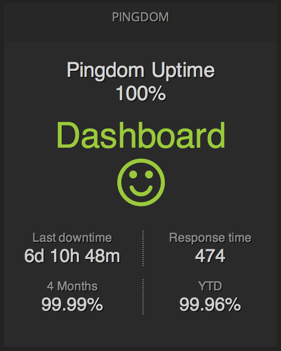

Pingdom Uptime
==============




### Requirement

The smile face requires font-awesome >= 4.1.0. dashing-contrib includes 4.1.0 CSS, you only need to [download](https://github.com/FortAwesome/Font-Awesome/tree/master/fonts) webfonts and replace generated fonts under `/assets/fonts` folder.

### Example html usage

````
<li data-row="1" data-col="1" data-sizex="1" data-sizey="1">
    <div data-view="PingdomUptime"
         data-id="pingdom-uptime"
         data-title="Dashboard"></div>
</li>
````


### Example job

This also shows a coupld of dashing-contrib data APIs for pingdom. 

````
require 'dashing-contrib/bottles/pingdom'

SCHEDULER.every '30s' do
  nowTime = Time.now.to_i
  t1_month = 86400 * 30

  # 24 hours
  defaultDateRange = nowTime - 86400
  # 4 months ago
  firstDateRange = nowTime - (t1_month * 4)
  # 1 year to date
  secondDateRange = nowTime - (t1_month * 12)

  client = DashingContrib::Pingdom::Client.new(
    username: ENV['PINGDOM_USERNAME'],
    password: ENV['PINGDOM_PASSWORD'],
    api_key:  ENV['PINGDOM_API_KEY']
  )
  # checks id provided by pingdom
  id = '1234432'
  current_uptime = client.uptime(id, defaultDateRange, nowTime)
  first_uptime   = client.uptime(id, firstDateRange, nowTime)
  second_uptime  = client.uptime(id, secondDateRange, nowTime)
  status   = client.checks(id)

  data = {
    current: current_uptime.to_s,
    first:  first_uptime.to_s,
    first_title: '4 Months',
    second: second_uptime.to_s,
    second_title: 'YTD',
    is_up: status[:check][:status] == 'up',
    current_response_time: status[:check][:lastresponsetime],
    last_downtime: ::DashingContrib::Time.readable_diff(::Time.at(status[:check][:lasterrortime]))
  }
  
  send_event("pingdom-uptime", data)
end
````


