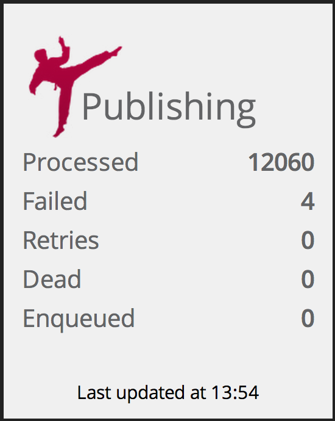

Sidekiq Widget
===============

Sidekiq widget and documentation is intially developed by [pallan](https://github.com/pallan) with some improvements.




## Usage

Add the widget HTML to your dashboard
```html
    <li data-row="2" data-col="4" data-sizex="2" data-sizey="2">
      <div data-id="sidekiq" data-view="Sidekiq" data-title="Sidekiq" style=""></div>
    </li>
```

## Job setup

Create a `jobs/sidekiq.rb` in your dashing project.


```ruby

# Require a built-in job
require 'dashing-contrib/jobs/sidekiq'

# Configure the job and setup Sidekiq connection
# 'event' is your dashing event name

DashingContrib::Jobs::Sidekiq.run every: '10s', event: 'sidekiq-metric-name' do
  Sidekiq.configure_client do |config|
    config.redis = { url: 'redis://localhost.com:6379', namespace: 'sidekiq:namespace' }
  end
end
```
